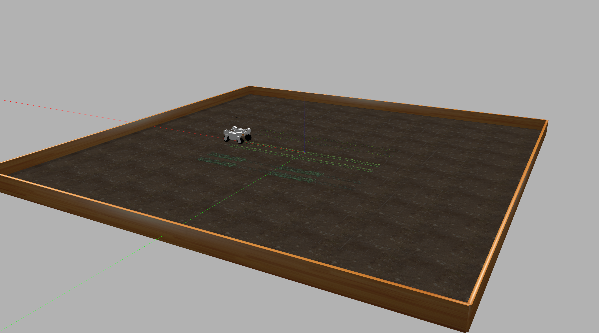

# thor-explorer

[![Contributors][contributors-shield]][contributors-url]
[![Forks][forks-shield]][forks-url]
[![Stargazers][stars-shield]][stars-url]
[![Issues][issues-shield]][issues-url]
[![MIT License][license-shield]][license-url]


<!-- PROJECT LOGO -->
<br />
<p align="center">
  <a href="https://github.com/Harry-Rogers/thor-explorer">
    
    
  </a>

  <h3 align="center">thor-explorer</h3>

  <p align="center">
    An awesome ROS package for the LCAS Thorvald robot! For deployment around an unknown area!
    <br />
    <a href="https://github.com/Harry-Rogers/thor-explorer"><strong>Explore the docs »</strong></a>
    <br />
    <br />
    <a href="https://github.com/Harry-Rogers/thor-explorer">View Demo</a>
    ·
    <a href="https://github.com/Harry-Rogers/thor-explorer/issues">Report Bug</a>
    ·
    <a href="https://github.com/Harry-Rogers/thor-explorer/issues">Request Feature</a>
  </p>
</p>


<!-- TABLE OF CONTENTS -->
<details open="open">
  <summary>Table of Contents</summary>
  <ol>
    <li>
      <a href="#about-the-project">About The Project</a>
      <ul>
        <li><a href="#built-with">Built With</a></li>
      </ul>
    </li>
    <li>
      <a href="#getting-started">Getting Started</a>
      <ul>
        <li><a href="#prerequisites">Prerequisites</a></li>
        <li><a href="#installation">Installation</a></li>
      </ul>
    </li>
    <li><a href="#usage">Usage</a></li>
    <li><a href="#roadmap">Roadmap</a></li>
    <li><a href="#contributing">Contributing</a></li>
    <li><a href="#license">License</a></li>
    <li><a href="#contact">Contact</a></li>
    <li><a href="#acknowledgements">Acknowledgements</a></li>
  </ol>
</details>


<!-- ABOUT THE PROJECT -->
## About The Project



This ROS package uses the prebuilt simulation area and Thorvald system built by LCAS to autonomously navigate an unknown area using the Thorvald system.

Whilst the system uses ROS Nav base this package maps the surroundings as well as weeds that are potentially idetinfied.

### Built With

* [UOL](https://github.com/LCAS/CMP9767M)
* [ROS Nav](http://wiki.ros.org/navigation)
* [ROS Gmapping](http://wiki.ros.org/gmapping)


<!-- GETTING STARTED -->
## Getting Started

To get a local copy up and running follow these simple example steps.

### Prerequisites

This is an example of how to list things you need to use the software and how to install them.
* ROS melodic
  ```sh
  http://wiki.ros.org/melodic/Installation
  ```
* UOL Core ROS libraries 
  ```sh
  sudo ls
  sudo apt-get update && sudo apt-get install curl
  curl https://raw.githubusercontent.com/LCAS/rosdistro/master/lcas-rosdistro-setup.sh | bash -  
  ```
  * Melodic Core ROS libraries 
  ```sh
  sudo apt-get install \ 
    ros-melodic-robot-localization \
    ros-melodic-thorvald \
    ros-melodic-gmapping \
    ros-melodic-opencv-apps \
    ros-melodic-find-object-2d \
    ros-melodic-video-stream-opencv \
    ros-melodic-image-geometry \
  ```
  
### Installation

1. Clone the repo
   ```sh
   git clone https://github.com/Harry-Rogers/thor-explorer
   ```

<!-- USAGE EXAMPLES -->
## Usage

This package can be reconfigured to work with any robot that uses ROS navigation package and the Gmapping package. 

_For more examples, please refer to the Documentation List below_

[ROS Navigation Documentation](http://wiki.ros.org/navigation)

[ROS Gmapping Documentation](http://wiki.ros.org/gmapping)

[OpenCV Documentation](https://docs.opencv.org/master/d6/d00/tutorial_py_root.html)


<!-- ROADMAP -->
## Roadmap

See the [open issues](https://github.com/Harry-Rogers/thor-explorer/issues) for a list of proposed features (and known issues).


<!-- CONTRIBUTING -->
## Contributing

Contributions are what make the open source community such an amazing place to be learn, inspire, and create. Any contributions you make are **greatly appreciated**.

1. Fork the Project
2. Create your Feature Branch (`git checkout -b feature/AmazingFeature`)
3. Commit your Changes (`git commit -m 'Add some AmazingFeature'`)
4. Push to the Branch (`git push origin feature/AmazingFeature`)
5. Open a Pull Request


<!-- LICENSE -->
## License

Distributed under the MIT License. See `LICENSE` for more information.


<!-- CONTACT -->
## Contact

Harry Rogers- https://harry-rogers.github.io/

Project Link: [https://github.com/your_username/repo_name](https://github.com/Harry-Rogers/thor-explorer)


<!-- ACKNOWLEDGEMENTS -->
## Acknowledgements
* [GitHub Emoji Cheat Sheet](https://www.webpagefx.com/tools/emoji-cheat-sheet)
* [Img Shields](https://shields.io)
* [Choose an Open Source License](https://choosealicense.com)
* [GitHub Pages](https://pages.github.com)
* [Animate.css](https://daneden.github.io/animate.css)
* [Loaders.css](https://connoratherton.com/loaders)
* [Slick Carousel](https://kenwheeler.github.io/slick)
* [Smooth Scroll](https://github.com/cferdinandi/smooth-scroll)
* [Sticky Kit](http://leafo.net/sticky-kit)
* [JVectorMap](http://jvectormap.com)
* [Font Awesome](https://fontawesome.com)


<!-- MARKDOWN LINKS & IMAGES -->
<!-- https://www.markdownguide.org/basic-syntax/#reference-style-links -->
[contributors-shield]: https://img.shields.io/github/all-contributors/Harry-Rogers/thor-explorer
[contributors-url]: https://github.com/Harry-Rogers
[forks-shield]: https://img.shields.io/github/forks/Harry-Rogers/thor-explorer
[forks-url]: https://github.com/Harry-Rogers/thor-explorer/network/members
[stars-shield]: https://img.shields.io/github/stars/Harry-Rogers/thor-explorer
[stars-url]: https://github.com/Harry-Rogers/thor-explorer/stargazers
[issues-shield]: https://img.shields.io/github/issues/Harry-Rogers/thor-explorer
[issues-url]: https://github.com/Harry-Rogers/thor-explorer/issues
[license-shield]: https://img.shields.io/github/license/Harry-Rogers/thor-explorer
[license-url]: https://github.com/Harry-Rogers/thor-explorerblob/master/LICENSE.txt

